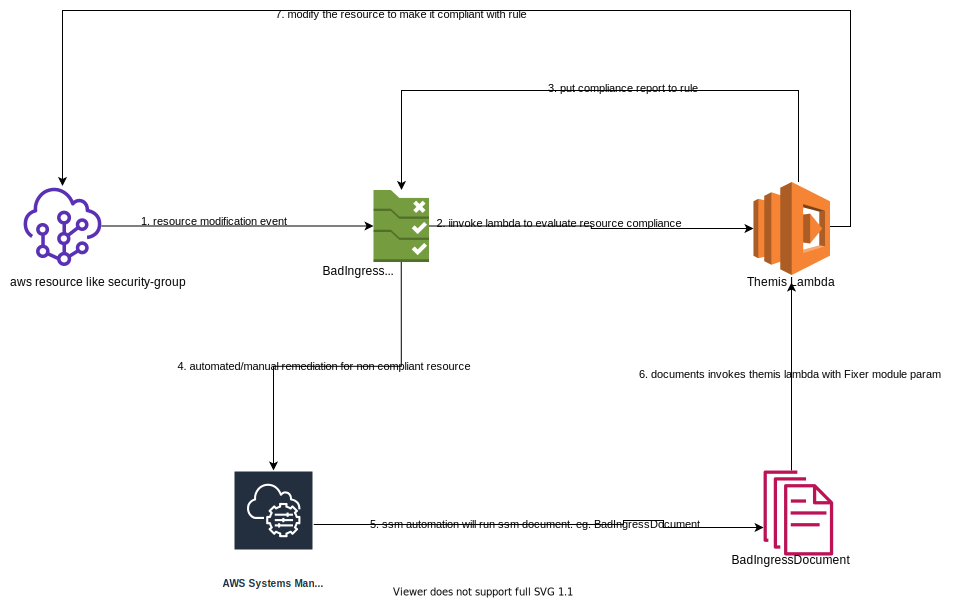

# Themis evaluates and fixes aws resources based on rules defined.

- [Architecture Diagram](#architecture-diagram)
- [Configurations](#configurations)
- [Deployment](#deployment)
- [Rules](#rules)
- [Contributions](#contributions)

Themis currently supports sending non-compliant alert notification through email using ses. Feel free to raise request for any other mechanism for notification delivery.

# Architecture Diagram:

# Configurations
There are 2 types of configuration
  - [themis project configuration](#themis-project-configuration)
  - [themis rule configuration](#themis-rule-configuration)

### Themis project configuration:
Themis project configuration is in [settings.json](settings.json) stored at root of the project. Settings file has parameters
  - themis  sender emails, reciever emails

### Themis rule configuration:
Each rule has a separate configuration in [rules](rules) directory at the root of the project. Themis rule will use the default configuration when custom account rule json is not present

##### How to create a custom rule configuration

create `aws_account_id/rule_name.json` directory inside [rules directory](rules) for custom rules definition based on account id.

Example: If we have two aws account with id (12345 and 67890). when we add 12345/bad_ingress.json in [rules directory](rules), bad_ingress deployed in account 12345 will use 12345/bad_ingress.json but account 67890 will used [default bad ingress json](rules/default/bad_ingress.json)

# Deployment

## install dependencies
`pip3 install pipenv`

`pipenv install`

## run tests
`pipenv run python3 -m pytest --cov=. tests/  -v`

# deployment command

`pipenv lock -r > requirements.txt`

`sam deploy -t template.yml --region us-east-1  --config-file samconfig.toml --profile default --guided`

EnableAutoFix is false by default. For enabling auto fix use the below deployment command:
`sam deploy -t template.yml --region us-east-1  --config-file samconfig.toml --profile default --guided --parameter-overrides EnableAutoFix=true`

# RULES:

## 1. Bad Ingress Rule
###### Evaluator:
bad ingress marks the security group as non-compliant if there is any ports mentioned in [bad ingress rules json](rules/default/bad_ingress.json) is publicly open in security group. The non-compliant security groups can be seen in aws config themis rule.

##### Fixer:
Fixer will close the publicly open ports to vpc cidr.

# Contributions

Feel free to submit a pull request for any generic rules